<div align="center">
  
</div>

```ts
const aditya = {
  role:      "Full-Stack Developer",
  at:        ["Agent Space AI — document intelligence for customs & trade", "MakeDIY — lead developer"],
  shipping:  "deterministic parsers, GraphQL APIs, Postgres pipelines, Next.js dashboards",
  principle: "if it's in production, it has numbers behind it",
  learning:  ["AI engineering", "agentic workflows", "system design"],
};
```

## `$ now` — Agent Space AI

I build the platform that reads import & export customs documents (Bills of Entry, Shipping Bills) and turns them into verified, queryable data — used in production by **2 enterprise healthcare/biotech clients**.

| | What I built | Proof |
|:-:|---|---|
|  | **Deterministic PDF parser** that replaced the OCR + AI extraction step — Python prototype, then ported to TypeScript inside the NestJS backend | Byte-identical output vs. the prototype on 21 real documents · 45-doc load test, 0 failures |
|  | **Production rollout** — Power Automate flow + custom connector through an on-prem gateway, promoted dev → stage → prod for two clients | Running on both clients' prod |
|  | **Automated triage checks** that flag bad extractions before a human reviews them | 6 checks, 21 unit tests |
|  | **Data-accuracy audit & fixes** — multi-IGM fix, DB migration, ingest fixes | 410 prod docs · 4,753 duty rows · **0 mismatches** |
|  | **Shipping Bill pipeline** into 5 Postgres tables + in-app notifications | 21,078 fields compared API vs CLI · 0 diffs |
|  | **Custom report builders** — pick fields, preview, export to Excel | Up to 50k rows |
|  | **Performance / SLA page** — clearance time in working days with a state holiday calendar | 80.4% cleared within 3 working days |

## `$ ls ~/projects`

| Project | Stack | Highlights |
|---|---|---|
| **[MakeDIY](https://makediy.in)** · lead dev | Next.js · Express · MongoDB · three.js | E-commerce + PCB & 3D-printing quote wizards with an in-browser 3D model viewer and live weight / print-time estimates · Paytm payments · JWT auth with refresh-token rotation · 17-section admin panel |
| **[Abbie Education](https://training.abbieeducation.world)** · LMS | Next.js · Node · Razorpay | Course → Chapter → Lesson structure, purchase flow, live with enrolled students |
| **[Diwan Foundation](https://allgujaratmuslimfakirdiwansamaj.org)** · NGO | Node · RBAC | Multi-role access, QR donation flow, auto-generated PDF certificates |

## `$ cat stack.json`

<p>
  
  <br/>
  
  <br/>
  
</p>

<p>
  
  
  
  
  
  
  
</p>

## `$ git log --stats`

<div align="center">
  
  
  <br/>
  
</div>

---

<div align="center">
  <a href="https://www.linkedin.com/in/aditya-gangil-5b8b98244/"></a>
  <a href="mailto:adityagangil182@gmail.com"></a>
  <a href="https://makediy.in"></a>
</div>
